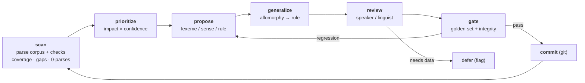

# Meta-workflows — the playbooks

A **meta-workflow** is a strategy: it sequences the smaller [[../workflows/README|workflows]]
(carried out by [[../skills/README|skills]]) toward a goal — "bootstrap a new language," "work the
backlog," "test a grammar theory." Meta-workflows may invoke other meta-workflows (the steady-state
cycle invokes the zero-parse loop).

This is *how a linguist actually works* across a session, not just one task. The sequencing follows
field-methods training (phonology → morphology → lexicon → texts; inflection before derivation;
high-frequency first — see [../References.md](../References.md) §9).

## The virtuous cycle (steady state)

The engine of the whole project: a parse-flag-propose-**generalize**-review-gate loop that measurably
reduces unparsed words and fills the lexicon without regressions.

> **This loop is TDD for grammar — Red → Green → Refactor.** *Red:* data that won't parse — 0-parse
> wordforms ([[../workflows/corpus-coverage-and-frequency]]) and bilingual flags
> ([[../workflows/parallel-translation-qa]]) — is a failing test. *Green:* propose the lexeme/sense/rule
> that makes it pass, accepted only at the golden gate. *Refactor:* once green, merge/refine and pick
> the *better* grammar with [[../skills/assess-grammar]] (the MDL + worst-part tools in
> `research/assess/`) — never on red. [[close-the-zero-parse-loop]] is the Red→Green inner loop;
> [[test-a-grammar-theory]] is the deep Refactor on a branch.



Each box is a [[../workflows/README|workflow]] driven by a [[../skills/README|skill]]: *scan* =
[[../workflows/corpus-coverage-and-frequency]] + [[../workflows/data-integrity-check]]; *prioritize* =
[[../skills/prioritize-the-backlog]]; *propose* = [[../skills/propose-from-evidence]]; *generalize* =
[[../skills/generalize-not-enumerate]]; *review* = [[../skills/guess-ask-or-defer]] +
[[../skills/phrase-for-a-speaker]]; *gate* = [[../skills/read-the-gate]] over the golden set.

## Bootstrapping a new language — strategies

Cold start has no single entry point; the [[bootstrap-a-new-language]] meta-workflow chooses among
strategies by what data exists. These are the field-tested on-ramps:

| Strategy | What it does | Grounded in | Leads into |
|---|---|---|---|
| **Introspect the language** | predict interesting/likely features (morphology type, phoneme norms) before diving in | Pike monolingual; WALS/Grambank/PHOIBLE; [[../skills/introspect-typology]] | parser skeleton |
| **Build the morphological skeleton** | affixes, position-class charts, inflection features, paradigm models | Nida; Payne; [[../primitives/affix-template-and-slot]] | parser-setup |
| **Paradigm elicitation** | define & parse paradigms (change one feature at a time) | Vaux & Cooper; Bowern | inflection features |
| **Comparative wordlist** | work a standard regional list (Swadesh / Leipzig-Jakarta / **SILCAWL/CAWL**) | comparative method | lexicon seed |
| **Parse available text** | run open Bibles / parallel literature straight through the parser | eBible; parallel method | the zero-parse loop |
| **Close the zero-parse loop** | find 0-parse wordforms → propose missing morphemes/rules → re-parse | the discovery cycle; [[close-the-zero-parse-loop]] | steady state |
| **Syntactic inspection (as input)** | use phrase context to gloss words / rule out parses — context as *input*, never emitting syntax | "syntax in, not out"; [[../workflows/parallel-translation-qa]] | disambiguation |
| **Web research** | typological/comparative lookup for an unfamiliar pattern | — | any of the above |

## Theory testing (refactor a scratch copy)

The MCP/git pairing makes it cheap to **branch the grammar, try a theory, and measure it** — e.g.
"reanalyze these three allomorphs as one stem + a rule." [[test-a-grammar-theory]]: branch → apply
the change-set → run golden set + coverage → keep (merge) or discard (delete branch). The *measure*
step is [[../skills/assess-grammar]] — compare the two grammars' description length
(`research/assess/mdl.py` `better_grammar` / `decide_split_or_combine`) on top of the golden round-trip,
so "keep or discard" is a number, not a hunch. Git *is* the scratch copy; no risk to the working
grammar.

> **Engine constraint:** a FLEx project is configured for **Hermit Crab *or* XAmple, not both** — the
> two parsers are incompatible in one database. We are HC-only, so theory testing means HC scratch
> **branches**, not cross-engine comparison. Keep this in mind whenever "test a copy" is proposed.

## Meta-workflow catalog

- **[steady-state-virtuous-cycle](steady-state-virtuous-cycle.md)** — the core loop *(exemplar)*
- [bootstrap-a-new-language](bootstrap-a-new-language.md) — cold start; choose an on-ramp by available data
- [close-the-zero-parse-loop](close-the-zero-parse-loop.md) — the tight inner engine (0-parse → propose → re-parse)
- [test-a-grammar-theory](test-a-grammar-theory.md) — branch, experiment, measure, keep/discard
- [build-the-lexicon](build-the-lexicon.md) — RWC + wordlists → entries → senses → publish-ready

## File template

```markdown
# <meta-workflow name>

> One sentence: the goal.

**Invokes (workflows):** …  ·  **Skills:** …  ·  **When to run:** …

## Goal & when to use it
## The play (sequence)
A numbered sequence or a diagram of which workflows run in what order, with branch/loop points.

## Decision points
Where judgment routes the path (guess/ask/defer; generalize-or-list; commit/revert).

## Inputs → outputs
## Training basis / "how real linguists work"
## Pitfalls
```
