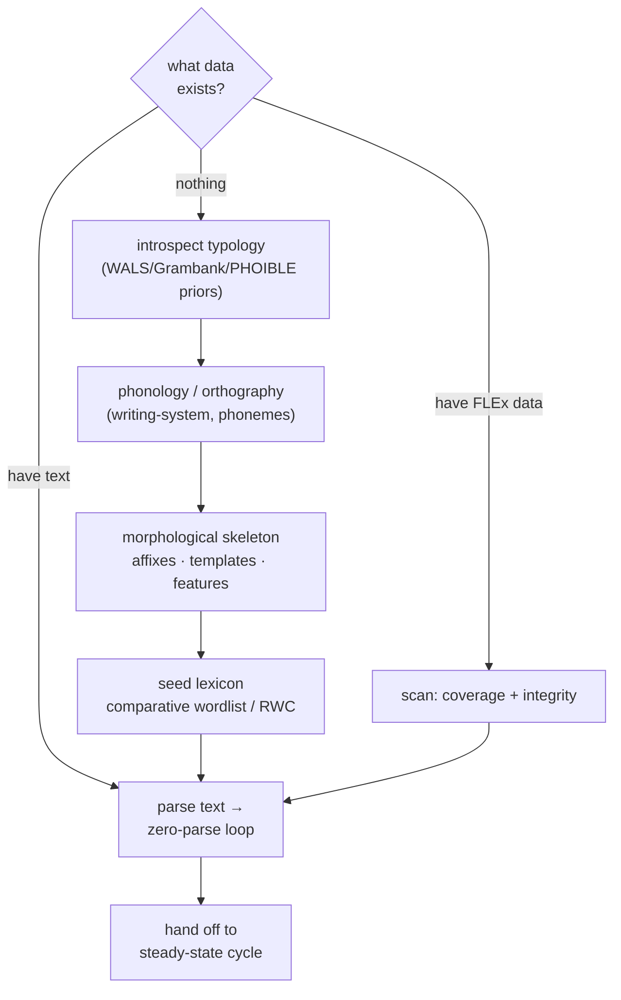

# bootstrap-a-new-language

> Cold start: choose an on-ramp by what data exists, build phonology → morphology → seed lexicon →
> parse text, then hand off to the steady-state cycle.

**Invokes (workflows):** [[../workflows/morphological-parser-setup]],
[[../workflows/lexeme-and-lexicon-building]], [[../workflows/semantic-domain-elicitation-rwc]],
[[../workflows/corpus-coverage-and-frequency]]  ·  **Skills:** [[../skills/introspect-typology]],
[[../skills/propose-from-evidence]], [[../skills/generalize-not-enumerate]]  ·  **When to run:** once,
at the start of a new language — when there is no working parser + seed lexicon yet. Exits into
[[steady-state-virtuous-cycle]].

## Goal & when to use it

A new FLEx project has no single entry point. The right first move depends entirely on **what data
already exists** — nothing, some text, or a populated FLEx database. This meta-workflow picks the
on-ramp, then runs the field-methods ordering (phonology/orthography → morphological skeleton → seed
lexicon → parse available text) until enough exists to feed the inner loops.

## The play (sequence)

1. **Choose the on-ramp** ([[../skills/introspect-typology]]) — predict likely features from family
   priors when there is no data; otherwise start from the text or the existing database.
2. **Phonology / orthography** — fix the [[../primitives/writing-system]] and phoneme inventory first;
   everything downstream parses against it (Pike; Vaux & Cooper sequencing).
3. **Morphological skeleton** — via [[../workflows/morphological-parser-setup]]: propose affixes,
   [[../primitives/affix-template-and-slot]] position classes, and [[../primitives/inflection-feature]]
   sets from the first parses ([[../skills/propose-from-evidence]]). Inflection before derivation;
   change one feature at a time (Vaux & Cooper; Bowern).
4. **Seed lexicon** — via [[../workflows/lexeme-and-lexicon-building]] +
   [[../workflows/semantic-domain-elicitation-rwc]]: work a standard comparative wordlist
   (Swadesh 100/207, Leipzig-Jakarta 100, or **SILCAWL ~1,700** for African languages) and the RWC
   semantic domains.
5. **Parse available text** — run open parallel corpora (eBible) through the parser via
   [[../workflows/corpus-coverage-and-frequency]] to surface the first backlog.
6. **Hand off** — once a basic parser + seed lexicon exist, exit into
   [[steady-state-virtuous-cycle]] (and its inner [[close-the-zero-parse-loop]]).

## Decision points

- **On-ramp by data** — the top branch; never elicit from scratch if usable text or a database exists.
- **Generalize-or-list** (step 3) — even the skeleton's allomorphy should be stated as rules where
  justified ([[../skills/generalize-not-enumerate]]).
- **Seed source** — Swadesh/Leipzig-Jakarta for any language; SILCAWL for African families.

## Inputs → outputs

- **In:** language metadata, typological priors, any available text/wordlist/FLEx project.
- **Out:** a working orthography, a morphological skeleton, a seed lexicon, a first coverage scan —
  i.e. the preconditions [[steady-state-virtuous-cycle]] needs to run.

## Training basis / "how real linguists work"

The course-proven field-methods ordering — phonetics/phonology → morphology → lexicon → texts (Pike
1947; Nida 1949; Vaux & Cooper 1999; Bowern) — with typological databases as priors (WALS/Grambank/
PHOIBLE) and standard comparative wordlists as the lexicon seed. See [../References.md](../References.md)
§9 (pedagogy) and §10 (bootstrap data).

## Pitfalls

- **Eliciting before scanning** — if a FLEx database or text exists, parse it first; don't re-collect
  what is already there.
- **Orthography churn** — changing the writing system after the lexicon is seeded invalidates parses;
  settle phonology/orthography early.
- **Enumerating the skeleton** — listing every affix variant instead of stating one rule produces a
  brittle parser that the steady-state cycle then has to unwind.
