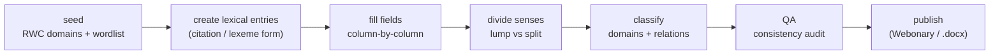

# build-the-lexicon

> Grow a publishable dictionary: seed via RWC + comparative wordlist, create entries, fill fields
> column-by-column, divide senses, classify, QA, and publish — the Dictionary Development Process.

**Invokes (workflows):** [[../workflows/semantic-domain-elicitation-rwc]],
[[../workflows/lexeme-and-lexicon-building]], [[../workflows/lexicon-consistency-audit]],
[[../workflows/dictionary-publishing]]  ·  **Skills:** [[../skills/divide-senses]],
[[../skills/prioritize-the-backlog]], [[../skills/guess-ask-or-defer]]  ·  **When to run:** once a seed
lexicon exists and the goal shifts from parsing to producing a publishable dictionary.

## Goal & when to use it

Take a seed lexicon to a **publishable dictionary** by following the Dictionary Development Process:
collect breadth first (semantic domains), then deepen entry-by-entry and field-by-field, QA, and
publish. Run it when the project's goal is a usable dictionary product, not just parser coverage.

## The play (sequence)

1. **Seed** — collect breadth via [[../workflows/semantic-domain-elicitation-rwc]] (RWC's **~1,800
   semantic domains** *(unverified — the published figure is commonly cited as ~1,700–1,800)*) plus a
   comparative wordlist (Swadesh / SILCAWL). Frequency / core vocabulary first
   ([[../skills/prioritize-the-backlog]]).
2. **Create entries** — make [[../primitives/lexical-entry]]s via
   [[../workflows/lexeme-and-lexicon-building]]; choose citation vs lexeme form deliberately for
   morphologically rich languages (Bartholomew & Schoenhals 1983).
3. **Fill fields column-by-column** — work **one field across all entries** before moving to the next
   (gloss, then POS, then example, …), not one entry to completion — the Coward & Grimes
   "column-based" discipline that keeps fields consistent.
4. **Divide senses** — lump vs split each [[../primitives/sense]] ([[../skills/divide-senses]]; Atkins
   & Rundell; Kilgarriff); route ambiguous calls to a speaker ([[../skills/guess-ask-or-defer]]).
5. **Classify** — attach [[../primitives/semantic-domain]] codes and
   [[../primitives/lexical-relation]]s (synonym, antonym, part/whole).
6. **QA** — run [[../workflows/lexicon-consistency-audit]] for missing fields, inconsistent glosses,
   orphaned senses.
7. **Publish** — produce the dictionary via [[../workflows/dictionary-publishing]] (Webonary, or
   built-in `.docx` export).

## Decision points

- **Lump vs split** (step 4) — the central lexicographic judgment; over-splitting bloats the
  dictionary, over-lumping hides meanings.
- **Guess / ask / defer** — ambiguous senses and glosses go to a speaker rather than a confident
  wrong entry.
- **Coverage vs depth** — prioritize core vocabulary breadth before deepening rare entries.

## Inputs → outputs

- **In:** seed lexicon, RWC domain elicitation, comparative wordlist, speaker access.
- **Out:** structured [[../primitives/lexical-entry]]s with divided senses, domains, and relations,
  consistency-audited and ready to publish.

## Training basis / "how real linguists work"

The SIL Dictionary Development Process: Bartholomew & Schoenhals (1983) on citation-form choice and
entry structure; Coward & Grimes on the **column-by-column** fill discipline; Atkins & Rundell and
Kilgarriff on sense division; Moe's RWC semantic-domain elicitation for breadth — all front-loaded by
frequency / core-vocabulary priority. See [../References.md](../References.md) §9 (pedagogy) and §10
(bootstrap data).

## Pitfalls

- **Entry-by-entry instead of column-by-column** — finishing one entry fully before the next produces
  inconsistent fields across the dictionary.
- **Over-splitting senses** — splitting on every contextual nuance bloats entries and confuses readers.
- **Skipping the QA audit** — publishing before [[../workflows/lexicon-consistency-audit]] ships
  missing glosses and orphaned senses to print.
