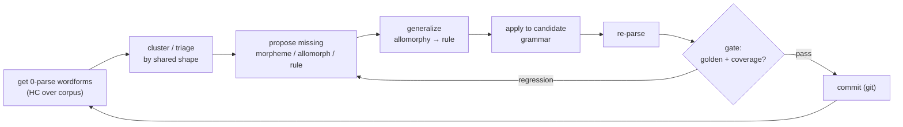

# close-the-zero-parse-loop

> The tight inner engine: take 0-parse wordforms, propose the missing morpheme/allomorph/rule,
> generalize it, apply, re-parse, gate, commit — repeat until the 0-parse set stops shrinking. This is
> the **Red → Green** inner loop of the grammar TDD cycle (a 0-parse is a failing test; the proposal
> makes it pass); the **Refactor** step — picking the *better* grammar — is handed to
> [[../skills/assess-grammar]] within [[steady-state-virtuous-cycle]].

**Invokes (workflows):** [[../workflows/corpus-coverage-and-frequency]],
[[../workflows/morphological-parser-setup]], [[../workflows/interlinearization]]  ·  **Skills:**
[[../skills/propose-from-evidence]], [[../skills/generalize-not-enumerate]],
[[../skills/read-the-gate]]  ·  **When to run:** continuously, inside
[[steady-state-virtuous-cycle]] — whenever the corpus has unparsed wordforms.

## Goal & when to use it

This is the smallest self-contained engine in the project: the discovery cycle that turns an
**unparsed wordform** into a committed grammar change. The steady-state cycle is the whole session;
this loop is what runs *inside* its propose→generalize→gate segment, focused narrowly on closing
zero-parses. Run it any time HC reports wordforms it cannot analyze.

## The play (sequence)

1. **Get 0-parses** — run [[../workflows/corpus-coverage-and-frequency]]; HC emits the wordforms it
   cannot analyze, ranked by frequency.
2. **Cluster / triage** — group 0-parses by shared shape (same suspected affix, same alternation), so
   one proposal can resolve many forms at once.
3. **Propose** — for a cluster, propose the missing [[../primitives/allomorph]], morpheme, or
   [[../primitives/phonological-rule]] ([[../skills/propose-from-evidence]], Nida discovery).
4. **Generalize** — collapse the listed alternation into one rule over a
   [[../primitives/natural-class]] when justified ([[../skills/generalize-not-enumerate]]). This is the
   step that makes the loop *converge* rather than grind form-by-form.
5. **Apply & re-parse** — write the change into a candidate grammar via
   [[../workflows/morphological-parser-setup]]; re-run the parser (optionally check glosses through
   [[../workflows/interlinearization]]).
6. **Gate** — run the golden `word→gloss` set + coverage; a regression bounces back to step 3
   ([[../skills/read-the-gate]]).
7. **Commit** — on pass, commit; pull the next 0-parse cluster.

## Decision points

- **Cluster granularity** (step 2) — too coarse and one proposal can't cover the group; too fine and
  you grind one form at a time.
- **Generalize-or-list** (step 4) — the convergence move; gated, never assumed.
- **Commit / revert** (step 6) — earned by the gate; an over-broad rule that "parses everything" must
  fail the golden set.

## Inputs → outputs

- **In:** corpus, current grammar + lexicon, golden set.
- **Out:** committed morpheme/allomorph/rule change-sets; a shrinking 0-parse set; rising coverage.

## Training basis / "how real linguists work"

Nida's (1949) morpheme-discovery procedure — recurring partials → complementary distribution →
phonological-conditioning test → allomorph vs morpheme — run with the parser *in the loop* as the
oracle: each proposed analysis is immediately tested by re-parsing, so the engine confirms or refutes
the linguist's hypothesis. See [../References.md](../References.md) §9.

## Pitfalls

- **Form-by-form grinding** — skipping the cluster/generalize steps reduces the loop to one fix per
  form; it never converges.
- **Coverage gaming** — reading coverage without the regression gate rewards over-broad rules.
- **Frequency blindness** — work high-frequency 0-parses first; rare forms rarely justify a rule.
