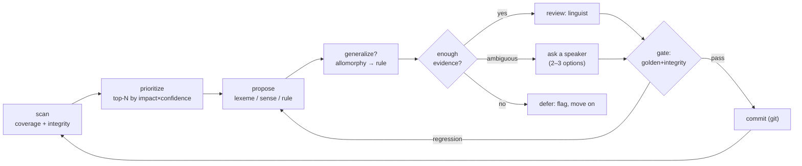

# steady-state-virtuous-cycle

> The core loop once a language is bootstrapped — **TDD for grammar**: **Red** (mono + bilingual data
> that won't parse) → **Green** (propose lexemes/rules to make it pass) → **Refactor** (merge/generalize
> and pick the better grammar), gated by the golden set. Run until coverage stops improving and the
> grammar stops simplifying.

**Invokes (workflows):** [[../workflows/corpus-coverage-and-frequency]],
[[../workflows/data-integrity-check]], [[../workflows/interlinearization]],
[[../workflows/morphological-parser-setup]], [[../workflows/lexeme-and-lexicon-building]],
[[../workflows/sense-discovery-and-disambiguation]], [[../workflows/parallel-translation-qa]]  ·
**Skills:** [[../skills/prioritize-the-backlog]], [[../skills/propose-from-evidence]],
[[../skills/generalize-not-enumerate]], [[../skills/guess-ask-or-defer]],
[[../skills/phrase-for-a-speaker]], [[../skills/read-the-gate]], [[../skills/assess-grammar]]  ·
**When to run:** continuously, once a basic parser + seed lexicon exist (after
[[bootstrap-a-new-language]]).

## Goal & when to use it

Turn an existing-but-incomplete grammar/lexicon into a steadily better one, measurably: each pass
should resolve real unparsed words / lexical gaps **without golden-set regressions**. It is the
project's reason for existing — the loop the README's "first milestone" closes.

## Red → Green → Refactor

| Phase | What it is here | Skills / tools |
|---|---|---|
| **Red** | failing tests = mono 0-parse wordforms ([[../workflows/corpus-coverage-and-frequency]]) **and** bilingual flags — missing sense, agreement mismatch ([[../workflows/parallel-translation-qa]]) | [[../skills/prioritize-the-backlog]] |
| **Green** | propose the lexeme/sense/rule that makes the form parse / clears the flag, accepted only at the gate | [[../skills/propose-from-evidence]], [[../skills/guess-ask-or-defer]], [[../skills/read-the-gate]] |
| **Refactor** | once green, merge/refine and pick the *better* grammar — never on red | [[../skills/generalize-not-enumerate]], [[../skills/assess-grammar]] → `research/assess/` (`metrics.py`, `mdl.py`, `worst_part.py`); golden gate `golden/hc.round_trip` |

## The play (sequence)

1. **Scan** — re-parse the corpus and run integrity checks; rebuild the prioritized backlog (unparsed
   forms, lexical gaps, parallel flags).
2. **Prioritize** — take the top-N by impact × confidence; don't grind low-value items.
3. **Propose** — for each, propose a fix ([[../skills/propose-from-evidence]]).
4. **Generalize** — try to collapse allomorphy into a rule ([[../skills/generalize-not-enumerate]]).
5. **Route** — [[../skills/guess-ask-or-defer]]: propose now / ask a speaker (via
   [[../skills/phrase-for-a-speaker]]) / defer with a flag.
6. **Gate** — apply to a candidate grammar; run the golden `word→gloss` set + integrity; regressions
   bounce back to step 3 ([[../skills/read-the-gate]]).
7. **Commit** — on pass, commit the change-set to git; loop.
8. **Refactor (periodic, once green)** — when the backlog is clearing, run [[../skills/assess-grammar]]
   over the grammar (`research/assess`: `metrics.py` scorecard + `worst_part.worst_part_ranking` +
   `mdl.worstness_mdl_ranking`) to find the **worst part**, and use `mdl.better_grammar` /
   `mdl.decide_split_or_combine` to merge/split/refine rules. Each refactor is itself gated (step 6) —
   a simpler grammar that regresses the golden set is reverted. *Never refactor while tests are red.*
   For a risky reanalysis, branch via [[test-a-grammar-theory]].

## Decision points

- **Generalize-or-list** (step 4) — the analyst move; gated, never assumed.
- **Guess / ask / defer** (step 5) — confidence routing; what lets a non-linguist contribute.
- **Commit / revert** (step 6) — earned by the gate, not by looking right.
- **Refactor / leave-alone** (step 8) — only once green; a merge/split is kept only if `ΔDL` drops
  *and* the golden gate still passes ([[../skills/assess-grammar]]).

## Inputs → outputs

- **In:** corpus, current grammar + lexicon, golden set, (optional) aligned parallel text.
- **Out:** a stream of reviewed, committed change-sets; a shrinking backlog; a coverage trend line.

## Training basis / "how real linguists work"

The collect → organize → **generalize** → test cycle of field morphology (Nida 1949; Payne 1997;
Bowern), with the SPE evaluation metric as the generalize step and frequency-first prioritization
(Zipf / core vocabulary). See [../References.md](../References.md) §9.

## Pitfalls

- **Coverage gaming** — never read coverage without the regression gate (over-broad rules "parse"
  everything). 
- **Backlog thrash** — re-prioritize each pass; frequencies shift as the lexicon grows.
- **Skipping the speaker** — when evidence is ambiguous, asking a speaker beats a confident wrong guess.
