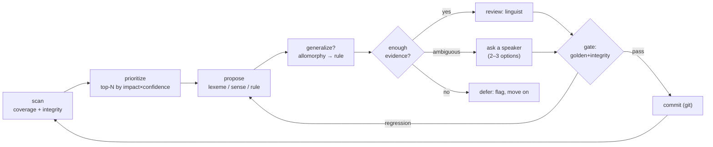

# steady-state-virtuous-cycle

> The core loop once a language is bootstrapped: parse → flag → prioritize → propose → generalize →
> review → gate → commit → re-parse, run until coverage stops improving.

**Invokes (workflows):** [[../workflows/corpus-coverage-and-frequency]],
[[../workflows/data-integrity-check]], [[../workflows/interlinearization]],
[[../workflows/morphological-parser-setup]], [[../workflows/lexeme-and-lexicon-building]],
[[../workflows/sense-discovery-and-disambiguation]], [[../workflows/parallel-translation-qa]]  ·
**Skills:** [[../skills/prioritize-the-backlog]], [[../skills/propose-from-evidence]],
[[../skills/generalize-not-enumerate]], [[../skills/guess-ask-or-defer]],
[[../skills/phrase-for-a-speaker]], [[../skills/read-the-gate]]  ·  **When to run:** continuously,
once a basic parser + seed lexicon exist (after [[bootstrap-a-new-language]]).

## Goal & when to use it

Turn an existing-but-incomplete grammar/lexicon into a steadily better one, measurably: each pass
should resolve real unparsed words / lexical gaps **without golden-set regressions**. It is the
project's reason for existing — the loop the README's "first milestone" closes.

## The play (sequence)

1. **Scan** — re-parse the corpus and run integrity checks; rebuild the prioritized backlog (unparsed
   forms, lexical gaps, parallel flags).
2. **Prioritize** — take the top-N by impact × confidence; don't grind low-value items.
3. **Propose** — for each, propose a fix ([[../skills/propose-from-evidence]]).
4. **Generalize** — try to collapse allomorphy into a rule ([[../skills/generalize-not-enumerate]]).
5. **Route** — [[../skills/guess-ask-or-defer]]: propose now / ask a speaker (via
   [[../skills/phrase-for-a-speaker]]) / defer with a flag.
6. **Gate** — apply to a candidate grammar; run the golden `word→gloss` set + integrity; regressions
   bounce back to step 3 ([[../skills/read-the-gate]]).
7. **Commit** — on pass, commit the change-set to git; loop.

## Decision points

- **Generalize-or-list** (step 4) — the analyst move; gated, never assumed.
- **Guess / ask / defer** (step 5) — confidence routing; what lets a non-linguist contribute.
- **Commit / revert** (step 6) — earned by the gate, not by looking right.

## Inputs → outputs

- **In:** corpus, current grammar + lexicon, golden set, (optional) aligned parallel text.
- **Out:** a stream of reviewed, committed change-sets; a shrinking backlog; a coverage trend line.

## Training basis / "how real linguists work"

The collect → organize → **generalize** → test cycle of field morphology (Nida 1949; Payne 1997;
Bowern), with the SPE evaluation metric as the generalize step and frequency-first prioritization
(Zipf / core vocabulary). See [../References.md](../References.md) §9.

## Pitfalls

- **Coverage gaming** — never read coverage without the regression gate (over-broad rules "parse"
  everything). 
- **Backlog thrash** — re-prioritize each pass; frequencies shift as the lexicon grows.
- **Skipping the speaker** — when evidence is ambiguous, asking a speaker beats a confident wrong guess.
