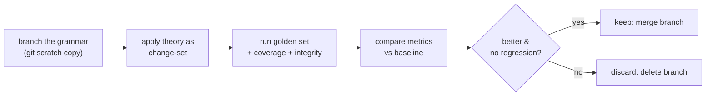

# test-a-grammar-theory

> Safely test a competing analysis: branch the grammar (git is the scratch copy), apply the theory as
> a change-set, run golden set + coverage, then keep (merge) or discard (delete branch).

**Invokes (workflows):** [[../workflows/data-integrity-check]],
[[../workflows/corpus-coverage-and-frequency]]  ·  **Skills:**
[[../skills/generalize-not-enumerate]], [[../skills/read-the-gate]]  ·  **When to run:** when two
analyses compete and you want a measured comparison — not during routine backlog work.

## Goal & when to use it

When a competing analysis is plausible — e.g. *reanalyze these three listed
[[../primitives/allomorph]]s as one stem plus a [[../primitives/phonological-rule]]* — you want to
**try it without endangering the working grammar**. The MCP/git pairing makes this cheap: a git branch
*is* the scratch copy, so refactoring a copy and measuring it costs almost nothing. Run it whenever a
reanalysis would simplify the grammar but you can't be sure it won't regress.

## The play (sequence)

1. **Branch** — create a git branch off the working grammar; this is the disposable scratch copy.
2. **Apply the theory** — write the reanalysis as a change-set on the branch (collapse the three
   allomorphs into one stem + a rule over a [[../primitives/natural-class]]), generalizing where
   justified ([[../skills/generalize-not-enumerate]]).
3. **Measure** — run [[../workflows/data-integrity-check]] and
   [[../workflows/corpus-coverage-and-frequency]] plus the golden `word→gloss` set on the branch.
4. **Compare** — read the branch metrics against the baseline: coverage delta, golden-set
   pass/regression, grammar simplicity ([[../skills/read-the-gate]]).
5. **Keep or discard** — merge the branch if it is strictly better with no regression; otherwise
   delete it. No state is left behind either way.

## Decision points

- **Keep / discard** (step 5) — the whole point: the theory earns the merge only by beating baseline
  *and* passing the gate. A simpler grammar that regresses the golden set loses.
- **Generalize-or-list** (step 2) — the reanalysis usually *is* a generalize move; it is still gated.

## Inputs → outputs

- **In:** baseline grammar + metrics, the competing analysis, golden set, corpus.
- **Out:** either a merged improvement (with recorded metric deltas) or a deleted branch — and a
  recorded reason. The working grammar is never at risk.

> **Engine constraint:** a FLEx project is configured for **Hermit Crab *or* XAmple, not both** — the
> two parsers are incompatible in one database. We are **HC-only**, so theory testing means **HC
> scratch branches**, not cross-engine comparison. "Test a copy" here always means a git branch of the
> HC grammar, never a parallel XAmple build.

## Training basis / "how real linguists work"

The SPE evaluation metric formalized as practice: prefer the analysis that captures the generalization
*and* survives the test set. Branch-and-measure mirrors how a linguist keeps competing analyses in a
notebook and adopts the one that explains more data with fewer statements (SPE; Martinet 1955;
Zwicky 1985). See [../References.md](../References.md) §9.

## Pitfalls

- **Merging on elegance** — a tidier grammar that regresses the golden set must be discarded; beauty
  is not the gate.
- **Cross-engine confusion** — do not frame this as HC-vs-XAmple; one database, one engine.
- **Leftover scratch state** — always delete a discarded branch so the working grammar stays clean.
