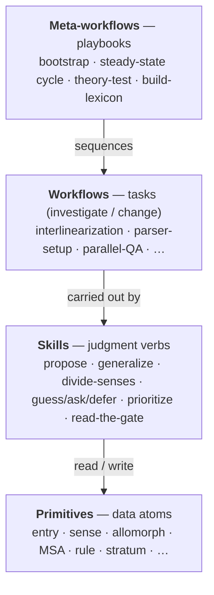

# Skills — the judgment layer

**Skills are the differentiator.** A rule engine (Hermit Crab) parses; the *skills* are the AI
judgment a trained linguist brings that a fixed parser lacks — proposing analyses from evidence,
**generalizing** allomorphy into rules, deciding *guess / ask a speaker / defer*, prioritizing a
backlog, and reading the gate. This folder is the design of that layer: each skill is a reusable
**judgment verb**, grounded in how real field linguists are trained (see
[../References.md](../References.md) §9–10).

> **The founding observation (from practice):** out of the box the model behaves like a *bright
> field-methods student* — it happily produces words and rules, but it **lists allomorphs** where a
> trained linguist would **state one phonological rule**. The single most important thing was teaching
> it to *generalize*. That is not a quirk; it is the **evaluation-metric / "capture the
> generalization" principle** (SPE; Martinet 1955) operationalized as a skill —
> [[generalize-not-enumerate]].

## The four-layer model

Primitives are the pieces, workflows are the moves, skills are the judgment, meta-workflows are the
plays:



A workflow says *what task*; a skill says *how a linguist judges it*; a meta-workflow says *which
tasks, in what order, toward what goal*. The same skill (e.g. [[guess-ask-or-defer]]) is reused
across many workflows.

## The judgment model

Three judgments recur everywhere and define the assistant's character:

1. **Generalize, don't enumerate** ([[generalize-not-enumerate]]). After proposing allomorphs, try to
   collapse them into one [[../primitives/phonological-rule]] over a [[../primitives/natural-class]];
   keep the rule only if it survives the golden-set round-trip. Zwicky's test routes the call:
   phonologically conditioned → rule; morphologically conditioned → listed allomorph; arbitrary →
   suppletion.
2. **Guess / ask / defer** ([[guess-ask-or-defer]]). The confidence-routed decision — *I know enough
   to propose*, vs *present 2–3 options to a native speaker* (phrased by [[phrase-for-a-speaker]]), vs
   *insufficient evidence, leave a flag and move on*. This is what makes an untrained speaker a
   first-class contributor.
3. **Earn the change at the gate** ([[read-the-gate]]). No proposal is "done" because it looks right;
   it is done when the golden `word→gloss` set and integrity checks pass without regression.

## The cycle is TDD (Red → Green → Refactor)

Building a grammar/lexicon is test-driven development, and the skills map onto its phases:

- **Red — a failing test.** Mono data that won't parse (0-parse wordforms) *and* bilingual data that
  flags (a missing sense, a number/agreement mismatch) are the failing tests. Surfaced by
  [[../workflows/corpus-coverage-and-frequency]] and [[../workflows/parallel-translation-qa]];
  prioritized by [[prioritize-the-backlog]].
- **Green — make it pass.** Propose the lexeme/sense/rule that makes the form parse / the flag clear
  ([[propose-from-evidence]], routed by [[guess-ask-or-defer]]), accepted only at [[read-the-gate]].
- **Refactor — improve without regressing.** Merge/refine rules ([[generalize-not-enumerate]]) and
  pick the better grammar with [[assess-grammar]] (the MDL + worst-part tools in `research/assess/`),
  always re-running the golden gate. *Don't refactor on red* — only refactor once the tests pass.

## Skill catalog

| Skill | Judgment | Grounded in | Used by (workflows / meta-workflows) |
|---|---|---|---|
| [[introspect-typology]] | predict a language's likely/interesting features before/while analyzing | Pike monolingual; WALS/Grambank/PHOIBLE; "interesting features first" | bootstrap; parser-setup |
| [[propose-from-evidence]] | from a corpus/parallel/zero-parse datum, propose a lexeme, sense, allomorph, or rule | Nida (1949) discovery procedure | most change workflows |
| **[[generalize-not-enumerate]]** *(flagship)* | collapse listed allomorphy into a rule + natural class when justified | SPE evaluation metric; Martinet (1955); Zwicky (1985) | parser-setup; interlinearization; steady-state; zero-parse loop; theory-test; bootstrap |
| [[divide-senses]] | lump vs split — is this a new [[../primitives/sense]] or a use of an existing one? | Atkins & Rundell (2008); Kilgarriff (1997) | sense-discovery; parallel-QA; lexicon-building |
| [[prioritize-the-backlog]] | rank issues by impact × confidence | Zipf / core-vocabulary coverage | the scan→work ordering (steady-state; build-lexicon) |
| [[guess-ask-or-defer]] | route a decision: propose now / ask a speaker / defer | accessibility goal; field elicitation practice | all workflows |
| [[phrase-for-a-speaker]] | turn a linguistic question into one an untrained native speaker can answer | RWC elicitation; LAMP | interlinearization; sense-discovery; parallel-QA |
| [[read-the-gate]] | interpret golden-set + integrity results; commit / revise / revert | the engine+oracle principle | all change workflows; theory-test |
| [[assess-grammar]] | judge grammar quality — worst part / better? / split-or-combine? — and gate refactors | MDL (Goldsmith 2001); SPE; Yang 2016; Dressler 1987; tools in `research/assess/` | the **Refactor** step: steady-state; theory-test; zero-parse loop |

## File template

```markdown
# <skill name>

> One sentence: the judgment this skill performs.

**Judgment type:** propose | decide | prioritize | verify | communicate  ·  **Grounded in:** <refs>
·  **Used by:** <workflows / meta-workflows>

## The judgment
What it decides/produces and the heuristic a trained linguist uses.

## Heuristic / procedure
The decision rule or steps (a small decision tree where useful).

## Inputs → outputs
## Interaction with other skills & the gate
## Failure modes / guardrails
## Training basis
Citations → ../References.md.
```

## Index

- **[generalize-not-enumerate](generalize-not-enumerate.md)** — allomorphy → rule *(exemplar; flagship)*
- [introspect-typology](introspect-typology.md) — predict features from priors
- [propose-from-evidence](propose-from-evidence.md) — Nida discovery → a proposal
- [divide-senses](divide-senses.md) — lump vs split
- [prioritize-the-backlog](prioritize-the-backlog.md) — impact × confidence
- [guess-ask-or-defer](guess-ask-or-defer.md) — confidence routing
- [phrase-for-a-speaker](phrase-for-a-speaker.md) — accessible questions
- [read-the-gate](read-the-gate.md) — interpret the regression gate
- [assess-grammar](assess-grammar.md) — worst part / better? / split-or-combine? (the Refactor judgment; drives `research/assess/`)
